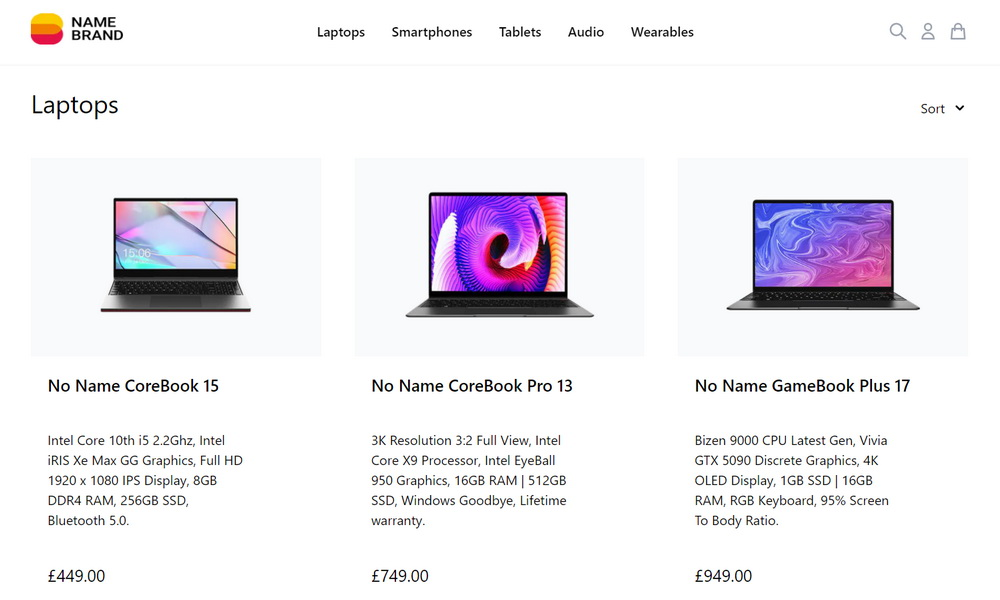

# Name Brand

Name Brand is a demo ecommerce store with full fledged features, such as product search and sorting, user authentication and order history. The project was built with Next.JS for static generation of product category and individual product pages, and styled with Tailwind CSS. Product database is stored in Firebase storage and Firestore, and payments are handled by Stripe.

Live site: [https://namebrand.vercel.app/](https://namebrand.vercel.app/)

## Stack

## Key Features

- Product categories
- Statically generated individual product pages
- Search products
- Stripe payment integration
- User account page showing order history
- Cached shopping basket
